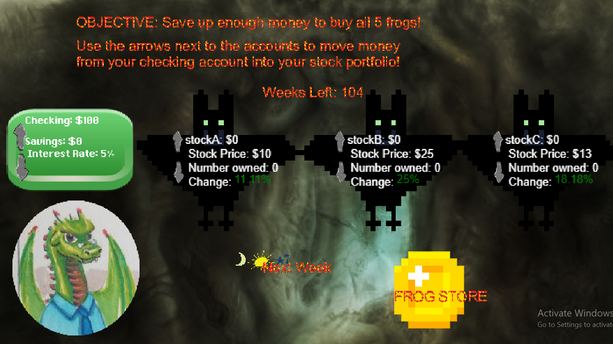

# If You Give a Dragon Economics (He's Going to Want Some Stocks)

By Alena Gusakov and Samantha Rosenthal

# Blurb
Drecko the Dragon has lived through the rise and fall of the gold standard. He understands that times are a-changing and that the wealth-hoarding scene isn’t what it used to be, so he gets a job in the city and uses the money to buy stocks and accumulate wealth. Drecko knows that money can’t buy happiness, but it can buy frogs, so he takes to collecting those.  Join Drecko as he learns how to navigate the stock market and make sound investments to accumulate all five frogs from the frog store! 

# Instructions
Use the stone arrows in the middle of the screen next to each stock to raise and lower the amount of each stock you own.  When you are happy with the distribution of your wealth, click the button labeled "next week".  You will be paid $100 each week, which is seperate from your winnings or losses from the stock market.  The value of your stocks will fluctuate each week.  Watch out for stock crashes!  

When you have enough money, you can go to the frog store by clicking the big coin.  Here you can buy frogs.  The price of each frog is written beneath it.  Click the "buy" button to buy a frog.  Remember that you buy things from your CHECKING ACCOUNT, not your stocks.  You may need to sell stocks to afford a frog.  

When you have all five frogs, you win!  Try to complete the game in 26 weeks, or take longer to experiment with your approach.  The game continues just the same when the week counter hits zero.  

Good luck on your frog collecting!

# Screenshot

# Video

Video at https://youtu.be/n-VZudPnR0o

# Citations
//Arrows by Unsolved Rubiks on opengameart.org
//Cave Background by Écrivain on opengameart.org
//Sun by dimonija on opengameart.org
//frog spirit by Snabisch on opengameart.org
//coin by irmirx on opengameart.org
//rocks by Écrivain on opengameart.org
//X by unirail on opengameart.org
//dragon by Alena
//frog store by Sam using Microsoft Paint
//fake newspaper by Sam using fodey at https://www.fodey.com/generators/newspaper/snippet.asp  
//winscene by Sam using Microsoft Paint
//animated frogs by Sam using Piskel at https://www.piskelapp.com/
//animated fire by Sam using Piskel at https://www.piskelapp.com/
//bat by Sam using Piksel at https://www.piskelapp.com/
//firefont by Sam using Littera at http://kvazars.com/littera/
//firefont texture by Sam using Microsoft Paint
//material colored icons by Babajan on opengameart.org
//background music by FoxSynergy on opengameart.com
//fire sound by themightyglider on opengameart.
//win music by remaxim on opengameart.com
//icons and favicon from https://game-icons.net/

